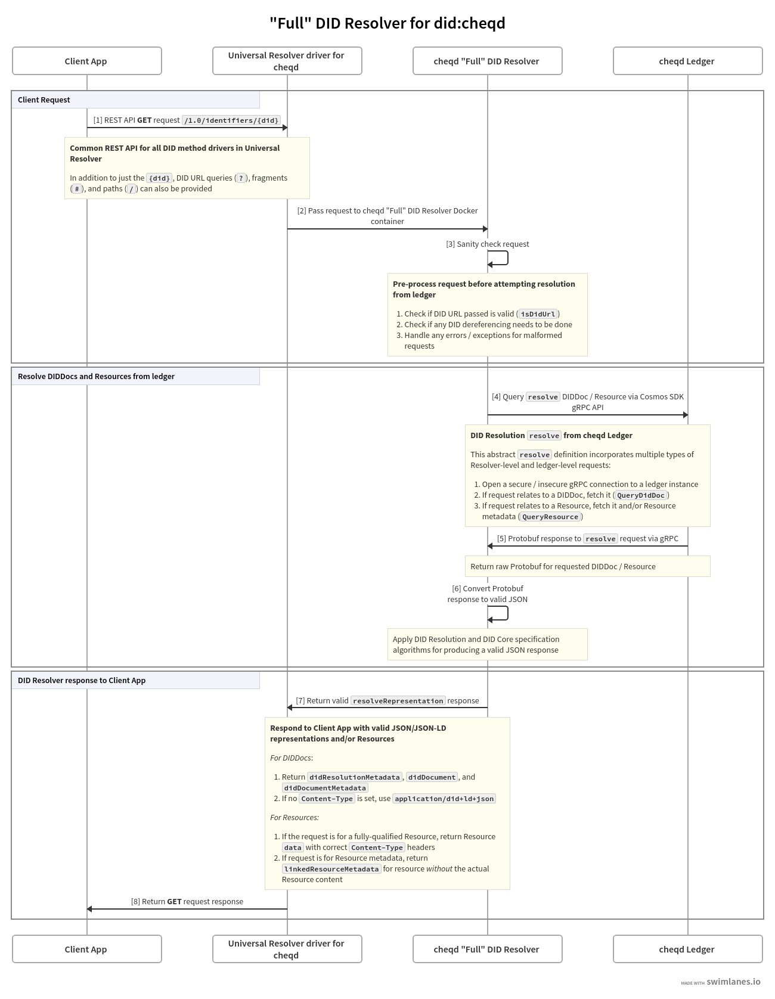

# 🔍 Understanding cheqd DID Resolver

## Overview

DID methods are expected to provide [standards-compliant methods of DID and DID Document ("DIDDoc") production](https://w3c.github.io/did-core/#production-and-consumption).

The [cheqd DID Resolver](https://github.com/cheqd/did-resolver) is designed to implement the [W3C DID _Resolution_ specification](https://w3c-ccg.github.io/did-resolution/) for [`did:cheqd`](https://docs.cheqd.io/node/architecture/adr-list/adr-002-cheqd-did-method) method.

> **💻 Github:** [**cheqd/did-resolver**](https://github.com/cheqd/did-resolver/)
>
> Code and deployment packages for the cheqd DID Resolver
## Design of cheqd DID Resolver

Since [cheqd uses the Cosmos SDK blockchain framework](https://blog.cheqd.io/why-cheqd-has-joined-the-cosmos-4db8845722c5), the underlying data storage and retrieval mechanisms used rely on those offered by the [Cosmos SDK framework](https://docs.cosmos.network/main/intro/overview.html).

Cosmos SDK [uses Protobuf (Protocol Buffers) encoding for its wire protocol](https://docs.cosmos.network/main/core/encoding.html) and provides [gRPC/gRPC-Web, JSON-RPC, and REST API endpoints for on-ledger modules](https://docs.cosmos.network/main/core/grpc_rest.html) and functionality.

The cheqd DID Resolver uses these existing gRPC/REST API endpoints to carry out DID URL Resolution and Dereferencing _not_ packaged within the [cheqd-node ledger code](https://github.com/cheqd/cheqd-node).

> **📝 Architecture Decision Record for cheqd DID Resolver**
>
> Full discussion and details on the [design of cheqd DID Resolver are available in its ADR](../architecture/adr-list/adr-003-did-resolver.md)

## Deployment patterns for cheqd DID Resolver

The current implementation of [**Universal Resolver driver for `did:cheqd`**](https://github.com/decentralized-identity/universal-resolver) uses the _Full cheqd DID Resolver_ deployment pattern described below.

The Universal Resolver project aims to provide a common REST API definition for DID Resolution where each DID method can provide a Docker container that with an easy-to-deploy mechanism for the specific DID method.

### "Full" cheqd DID Resolver

The _Full cheqd DID Resolver_ is able to use `github.com/cheqd/cheqd-node` as a Golang module for send `resolve` requests to a cheqd node instance to fetch DIDDoc / Resources from the ledger.

Since the _Full cheqd DID Resolver_ is wrapped for usage as a Docker container image using the Universal Resolver specification, the end-to-end sequence diagram for our DID Resolver would look like below:

_Figure 1_: "Full" cheqd DID Resolver sequence diagram ([editable version](https://swimlanes.io/u/CE_Rjphs9?rev=7))

1. Since the [cheqd-node ledger](https://github.com/cheqd/cheqd-node) / Cosmos SDK is written in Golang, this resolver would consist of Golang libraries imported from the existing ledger code. This promotes code reuse.
2. Data would be fetched from the ledger using the gRPC endpoint on a node, which allows it (by default) to take place over an encrypted channel [since gRPC uses HTTP/2](https://grpc.io/).
3. Data retrieved would be in the native Protobuf representation as stored on ledger, thus allowing data integrity computations to be made.

### "Light" cheqd DID Resolver

_This deployment pattern for the cheqd DID Resolver has not been built and released yet. It is described here to provide information on potential future areas of making DID Resolution easier than the current industry state-of-the-art._

1. Universal Resolver drivers are designed to be run as Docker containers. A limitation of this approach is that the computation footprint of a compute resource can be quite high, e.g., a Docker container may be 100 MB+ in size and [suffer from slow startup times in a "cold-start" scenario](https://mikhail.io/serverless/coldstarts/aws/).
2. Thus, our "Light" DID Resolver idea was to explore using [Cloudflare Workers](https://workers.cloudflare.com/), a lightweight serverless compute platform. As a comparison, [Cloudflare Workers are limited to 1 MB in size](https://developers.cloudflare.com/workers/platform/limits/) and [have extremely low cold-start times](https://blog.cloudflare.com/eliminating-cold-starts-with-cloudflare-workers/). (We use Cloudflare Workers in [our Cosmos SDK Custom Data API](https://github.com/cheqd/data-api), for example.)
3. Cloudflare Workers can also be deployed outside the Cloudflare service in a Docker container using [Miniflare](https://miniflare.dev/). This could be used to provide a Docker container deployment option for the Universal Resolver `did:cheqd` driver.
4. However, a limitation of Cloudflare Workers is they do not allow a gRPC _request_ to be made to an external endpoint. This would force the "Light" cheqd Resolver to use the gRPC-Web / REST endpoint `resolve` implementation to fetch data from the ledger. This could be considered a higher risk profile in terms of data integrity by resolver operators / client applications.
